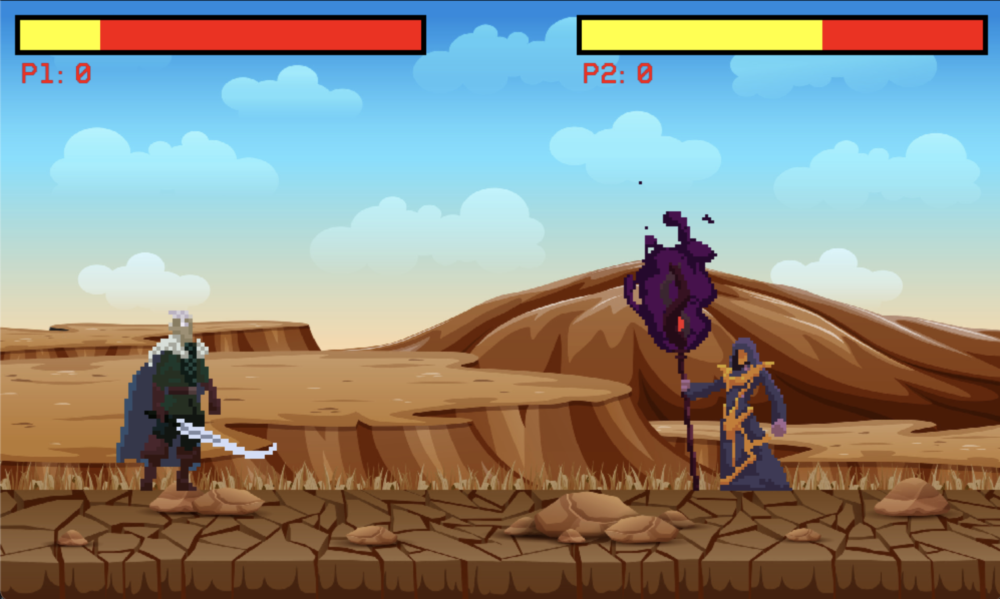

# Arcade Universe

Welcome to the Arcade Universe repository! This project contains four classic games implemented in Python using Pygame: Space Invader, Street Fighter, Tetris, and Minesweeper. Each game is designed to be run independently and provides a nostalgic gaming experience.


## Table of Contents

- [Games Included](#games-included)
  - [Space Invader](#1-space-invader)
  - [Street Fighter](#2-street-fighter)
  - [Tetris](#3-tetris)
  - [Minesweeper](#4-minesweeper)
- [Getting Started](#getting-started)
- [Requirements](#requirements)
- [Developers](#developers)
- [Future Improvements](#future-improvements)
- [Contributing](#contributing)

## Games Included

### 1. Space Invader

Space Invader is a classic arcade game where the player controls a spaceship and must shoot down incoming aliens while avoiding their attacks.


#### Features:

- Multiple levels with increasing difficulty.
- Different types of alien enemies.
- Power-ups for enhanced firepower.
- High-score tracking.

#### How to Play:

- **Movement**: Use the arrow keys to move the spaceship left and right.
- **Shooting**: Press the space bar to shoot.
- **Goal**: Destroy all aliens to advance to the next level without getting hit.

### 2. Street Fighter

Street Fighter is a fighting game where players choose characters to battle against each other. The goal is to deplete the opponent's health bar to win the match.



#### Features:

- Multiple playable characters with unique moves and abilities.
- Single-player and multiplayer modes.
- Special moves and combos.
- Dynamic background and sound effects.

#### How to Play:

- **Movement**: Use the arrow keys to move your character.
- **Attacks**: Use specific keys (e.g., A, S, D) for different attacks and special moves.
- **Goal**: Defeat your opponent by reducing their health to zero.

### 3. Tetris

Tetris is a tile-matching puzzle game where the player must fit falling blocks together to complete lines, which are then cleared from the screen.


#### Features:

- Classic Tetris gameplay with smooth controls.
- Increasing speed and difficulty over time.
- Score and level tracking.
- Hold and preview features for strategic gameplay.

#### How to Play:

- **Movement**: Use the arrow keys to move and rotate the falling blocks.
- **Drop**: Press the down arrow to drop blocks faster.
- **Goal**: Complete horizontal lines to clear them and score points. The game ends when the blocks stack to the top of the screen.

### 4. Minesweeper

Minesweeper is a puzzle game where the player must clear a grid of hidden mines without detonating any of them, using clues about the number of neighboring mines in each cell.


#### Features:

- Customizable grid sizes and difficulty levels.
- Flagging system to mark suspected mines.
- Timer and score tracking.
- Intuitive user interface.

#### How to Play:

- **Reveal Cells**: Click on cells to reveal them.
- **Flag Mines**: Right-click to place a flag on cells you suspect contain mines.
- **Goal**: Clear all non-mine cells to win, using numbers to deduce mine locations.

## Getting Started

To run any of these games, you need to have Python installed on your system. Follow these steps to get started:

1. Clone this repository:

   ```bash
   git clone https://github.com/Daniel0421/ArcadeUniverse.git
   ```

2. Install the required dependencies using pip:

   ```bash
   pip install pygame
   ```

3. Navigate to the game you want to play and run the `main.py` file:

   ```bash
   python main.py
   ```

4. Enjoy the game :)

## Requirements

- Python 3.x
- Pygame (for graphical games)
- Additional libraries required: Numpy, Pillow (for physics and OS handling)

Install the required dependencies using pip:

```bash
pip install numpy
```

```bash
pip install Pillow
```

## Developers

Two Computer Engineering students at the University of Illinois at Urbana-Champaign:

#### [Hyunseok Cho](https://github.com/hscho421)

#### [Jihwan Kim](https://github.com/jhkim160589)

## Future Improvements

Below will be implemented with the upcoming update:

- Implement sound effects and background music for a more immersive experience.
- Add power-ups or special abilities to enhance gameplay variety.
- Introduce more enemy types with unique behaviors and attack patterns.
- Implement a scoring system to track player performance and high scores.
- Optimize code for better performance and maintainability.

## Contributing

Contributions are welcome! Feel free to open issues or submit pull requests to improve the games or add new features. When contributing, please ensure you follow the coding standards and include appropriate tests.

## Acknowledgments

Special thanks to the creators of the original games for their inspiration.
Thanks to the open-source community for their valuable resources and support.
